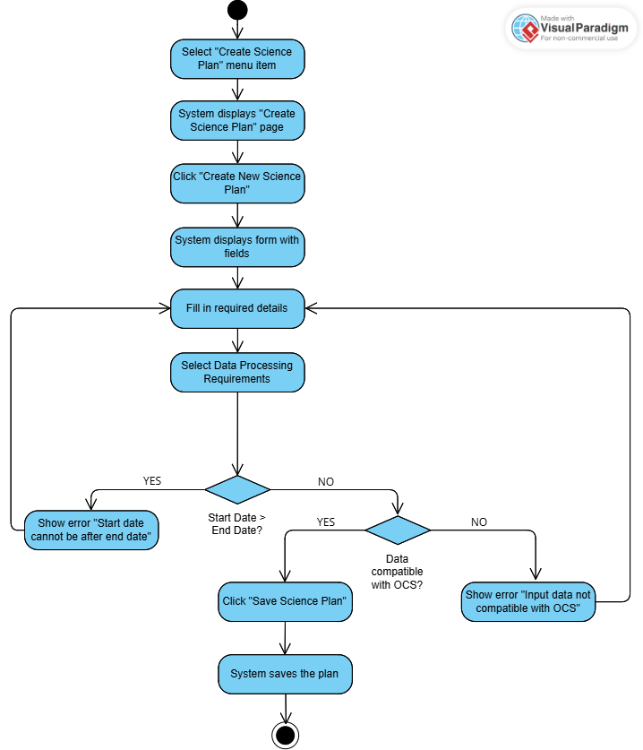
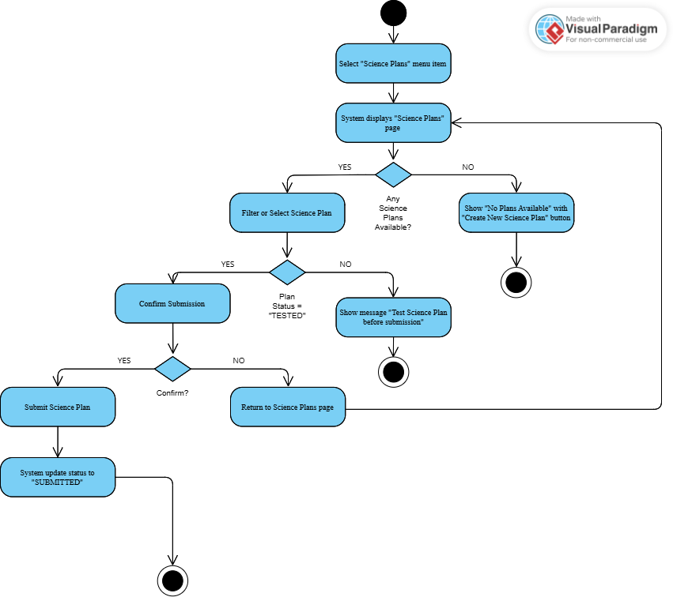
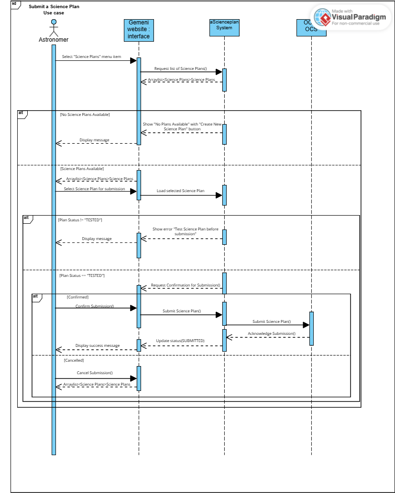
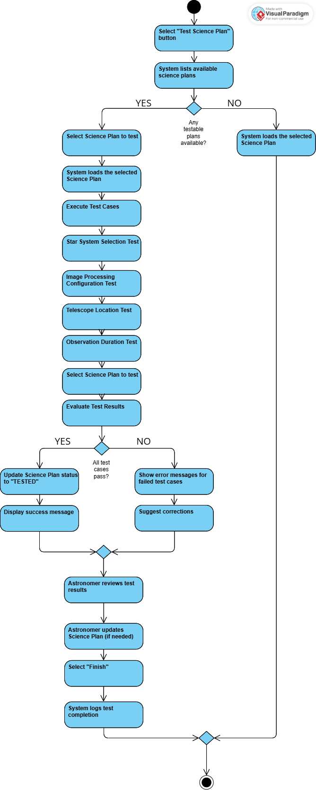
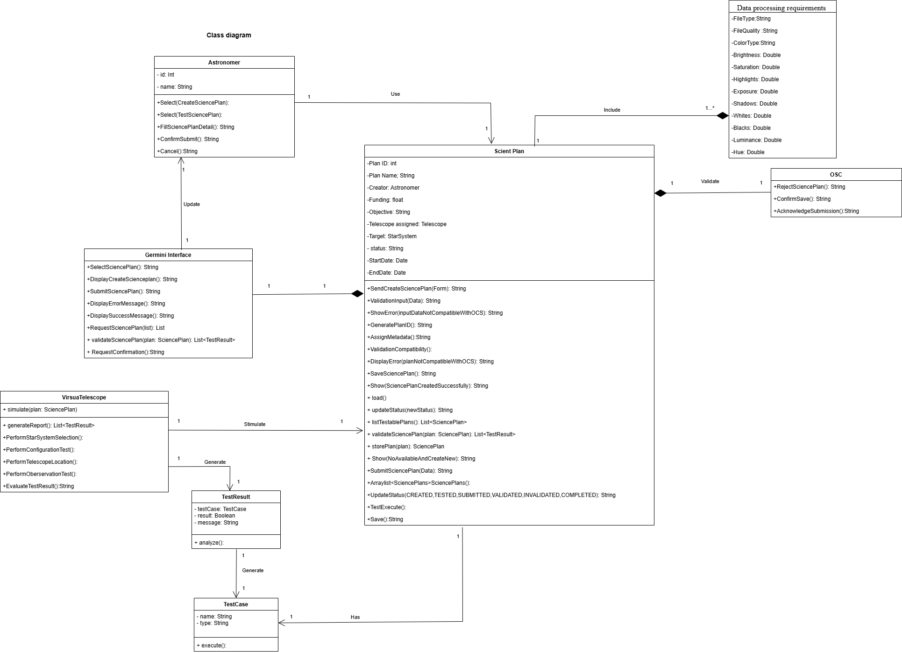

# REVISE

## Create a Science Plan

### Use Case Description

**Use Case Name:** Create Science Plans  
**ID:** U001  
**Importance Level:** High  
**Primary Actor:** Astronomer  
**Use Case Type:** Overview, Essential  

### Stakeholders and Interests
- **Astronomer:** Wants to create a science plan  

### Brief Description
An astronomer wants to create a science plan for planned planetary and star observations.  

### Precondition
The astronomer must have already logged in before this use case.  

### Trigger
An astronomer wants to create a science plan.  

### Type
External  

### Normal Flow of Events
1. An astronomer selects the "Create Science Plan" menu item.  
2. The system displays the Create a Science Plan page.  
3. The astronomer selects a button to create a new science plan and the create science plan form is shown containing the following information:  
   - **Plan ID:** Automatically generated  
   - **Plan Name:** Short plain text  
   - **Creator:** Automatically filled using the astronomer's account information  
   - **Funding:** Numerical values in Dollars with decimal points  
   - **Objective:** Long plain text  
   - **Start and End Dates:** Select from a calendar  
   - **Telescope Assigned:** List of two telescopes: Hawaii and Chile  
   - **Target:** Based on the star system selected from a list of star catalogue  
4. The astronomer fills in all the details.  
5. The astronomer selects the Data Processing requirements, including the following information:  
   - **FileType:** PNG, JPEG, RAW  
   - **FileQuality:** Low, Fine  
   - **ColorType:** Color mode, B&W mode  
   - **Contrast, Brightness, Saturation, Highlights, Exposure, Shadows, Whites, Blacks, Luminance, Hue:** Decimal values  
6. The astronomer creates the science plan by clicking the "Save Science Plan" button.  

### Alternate/Exceptional Flow
- **Step 5:** If the selected schedule has a start date after the end date, the system alerts with "Start date cannot be after the end date".  
- If the input data is not compatible with the legacy OCS system (e.g., invalid file format, unsupported field values, or missing required information), the system displays an error message: "Input data is not compatible with the legacy OCS system."  

### Activity Diagram
  

### Sequence Diagram
  

---

## Submit a Science Plan

### Use Case Description

**Use Case Name:** Submit a Science Plan  
**ID:** U002  
**Importance Level:** High  
**Primary Actor:** Astronomer  
**Use Case Type:** Essential  

### Stakeholders and Interests
- **Astronomer:** Wants to submit a previously created science plan  

### Brief Description
An astronomer wants to submit a science plan that has already been created in the system.  

### Precondition
The astronomer must have already logged in before this use case.  

### Trigger
An astronomer wants to submit a science plan.  

### Type
External  

### Normal Flow of Events
1. The astronomer selects the "Science Plans" menu item.  
2. The system displays the Science Plans page showing all the astronomer's science plans.  
   - The astronomer can filter science plans by their statuses (created, tested, submitted, validated, executed).  
3. The astronomer selects the science plan to be submitted.  
4. The system asks for confirmation of submission.  
   - If the astronomer selects "Confirm", the system submits the selected science plan.  
   - If the astronomer selects "Cancel", the system returns to the list of science plans.  

### Alternate/Exceptional Flow
- **Step 2:** If the astronomer does not have any created science plans, the system displays a blank page with an option to create a new one.  
- **Step 3:** The astronomer can only submit a science plan with the status "TESTED". If the science plan is created but not tested, the system instructs the astronomer to test it first.  

### Science Plan Statuses
- **CREATED:** The plan is created but not tested or submitted.  
- **TESTED:** The plan has completed testing.  
- **SUBMITTED:** The plan has been submitted to the Observatory Control System (OCS) and is awaiting validation.  
- **VALIDATED:** Successfully validated by a science observer.  
- **RUNNING:** Currently being executed in the OCS.  
- **INVALIDATED:** Rejected due to errors or inconsistencies.  
- **COMPLETE:** The plan has finished running.  
- **CANCELLED:** The plan has been canceled.  

### Activity Diagram
  

### Sequence Diagram
  

---

## Test a Science Plan

### Use Case Description

**Use Case Name:** Test Science Plans  
**ID:** U003  
**Importance Level:** High  
**Primary Actor:** Astronomer  
**Use Case Type:** Detail, Essential  

### Stakeholders and Interests
- **Astronomer:** Wants to test a science plan before submitting it to ensure feasibility and correctness.  

### Brief Description
This use case describes the process by which an astronomer tests a science plan using a virtual telescope before submission. The system verifies the science plan against multiple test cases to ensure it meets the required criteria.  

### Precondition
The astronomer must have already logged in before this use case.  

### Trigger
The astronomer initiates the testing process for a science plan.  

### Type
External  

### Normal Flow of Events
1. The astronomer selects the "Test Science Plan" button.  
2. The system lists all available science plans that can be tested.  
3. The astronomer selects a science plan to test.  
4. The system loads the selected science plan and prepares it for testing.  
5. The system executes the following test cases:  
   - **Star System Selection Test**  
   - **Image Processing Configuration Test**  
   - **Telescope Location Test**  
   - **Observation Duration Test**  
6. The system evaluates the test results.  
7. If all test cases pass, the system updates the science plan’s status to "TESTED".  
8. If any test case fails, the system provides an error message with details and suggested corrections.  
9. The astronomer reviews the test results and makes necessary adjustments.  
10. The astronomer updates the status of the tested science plan.  
11. The astronomer selects "Finish" to complete the process.  
12. The system logs the test completion and updates the plan’s record.  

### Alternate/Exceptional Flow
- **If no testable science plans are available:** The system displays "No available science plans for testing."  
- **If the selected science plan does not exist:** The system displays "Your selected science plan does not exist."  
- **If the science plan fails any test case:** The system provides an error message with details.  

### Activity Diagram
  

### Sequence Diagram
  

### Class Diagram
  
